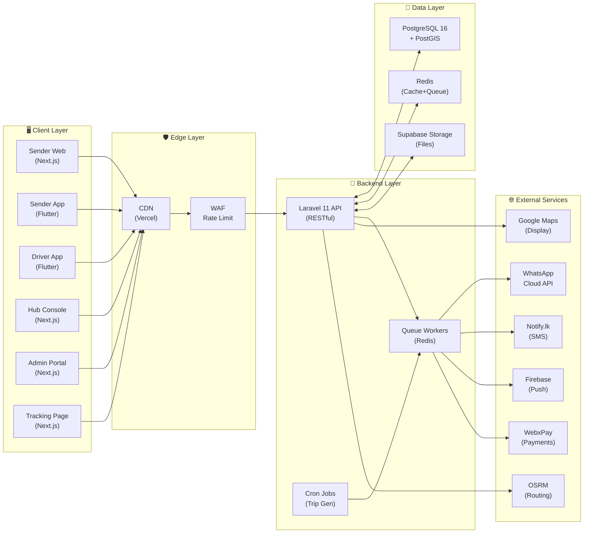
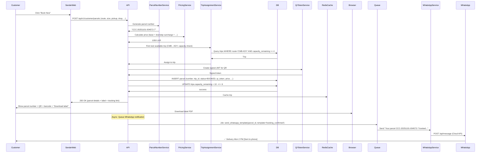
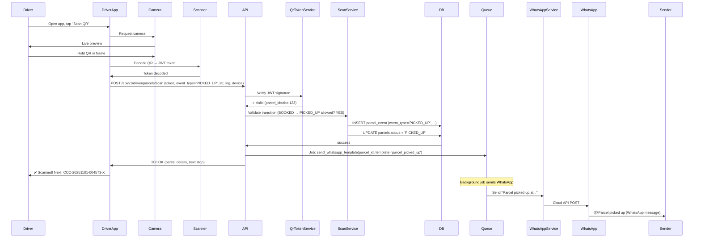
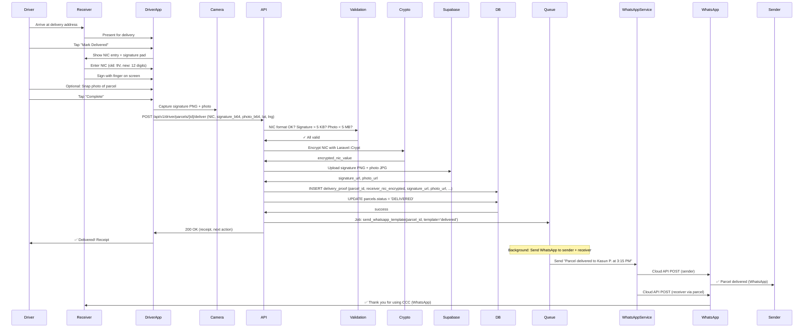
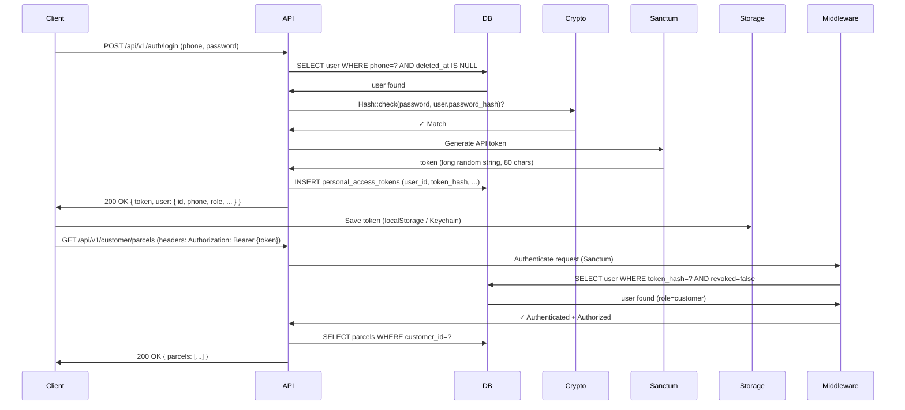

# Architecture — Colombo Cargo Connect

**Version:** 1.0  
**Last Updated:** May 1, 2026  
**Status:** Foundation Phase

---

## System Overview



---

## Layers & Responsibilities

### 1. Client Layer

| Component | Role | Users | Key Features |
|-----------|------|-------|-------------|
| **Sender Web** | Customer portal | Senders (shops, SMEs, agri) | Book parcel, track, pay, rate, dispute |
| **Sender App** | Mobile companion | Senders | Lightweight booking, notifications, tracking |
| **Driver App** | Field operations | Drivers | Scan QR, pick up, deliver, capture proof |
| **Hub Console** | Hub operations | Hub staff | Scan IN/OUT, manage inventory, print labels |
| **Admin Portal** | Central control | Ops, Finance, Support, Super | Trip management, pricing, users, disputes |
| **Tracking Page** | Public interface | Anyone with link | Real-time status, no login required |

### 2. Edge Layer (CDN + Security)

- **CDN (Vercel):** Static assets, images, JS bundles cached globally
- **WAF:** DDoS protection, rate limiting (100 req/min per IP for auth endpoints)
- **HTTPS:** All endpoints, HSTS enforced

### 3. Backend API Layer (Laravel 11)

Core business logic runs here.

#### Architecture Pattern: **Layered + Service**

```
Controllers (HTTP)
    ↓
Services (Business Logic)
    ↓
Models + Repositories (Data Access)
    ↓
Database
```

#### Key Services

| Service | Responsibility | Usage |
|---------|---|---|
| **PricingService** | Calculate final price from route + size + surcharges | When booking, generating invoices |
| **ParcelNumberService** | Generate unique CCC-YYYYMMDD-NNNNNN-X | On parcel creation |
| **QrTokenService** | Create/verify signed JWT for QR codes | On booking, on scan |
| **TripAssignmentService** | Auto-assign parcel to next available trip | When customer chooses auto-assign |
| **ScanService** | Validate status transition, log event, notify | On every QR scan |
| **WhatsAppService** | Send templated WhatsApp messages (queued) | On parcel status change |
| **PaymentService** | Create payment intent, verify webhook | When customer checks out |
| **NotificationService** | Dispatch notifications (WhatsApp, SMS, email, push) | From queue workers |

#### Routing Structure

```
/api/v1/
├── /auth/
│   ├── POST /register
│   ├── POST /login
│   ├── POST /logout
│   └── POST /refresh
│
├── /customer/
│   ├── POST /parcels (create booking)
│   ├── GET /parcels (list my parcels)
│   ├── GET /parcels/{id}
│   └── POST /parcels/{id}/rate
│
├── /driver/
│   ├── GET /trips (current + upcoming)
│   ├── GET /trips/{id}/parcels
│   ├── POST /parcels/{id}/scan
│   ├── POST /parcels/{id}/deliver
│   └── GET /dashboard
│
├── /hub/
│   ├── POST /parcels/{id}/scan-in
│   ├── POST /parcels/{id}/scan-out
│   └── GET /manifests
│
├── /admin/
│   ├── /trips (CRUD)
│   ├── /pricing-matrix (CRUD)
│   ├── /users (CRUD, KYC)
│   ├── /hubs (CRUD)
│   ├── /lorries (CRUD)
│   ├── /drivers (CRUD)
│   └── /disputes (list, resolve)
│
└── /public/
    ├── GET /parcels/{parcel_number}/track
    └── GET /hubs (list all hubs)
```

### 4. Data Layer

#### PostgreSQL 16 + PostGIS

**Core Tables:**

| Table | Purpose | Rows/Month (Estimate) |
|-------|---------|-------|
| `users` | Customers, drivers, staff, admins | +500 new users |
| `parcels` | Booking records | +50,000 new parcels |
| `parcel_events` | Scan events (10 per parcel avg) | +500,000 new events |
| `trips` | Scheduled runs (5–10 per day per route) | +150–300 new trips |
| `pricing_matrix` | Route × size lookup | Static (updates rare) |
| `notifications_log` | WhatsApp, SMS, email logs | +150,000 notification sends |
| `payments` | Payment records | +25,000 new payments |
| `delivery_proofs` | NIC + signature + photo | +25,000 (same as delivered parcels) |

**Indexes:** See `COLOMBO_CARGO_CONNECT_PLAN.md` Section 12.

#### Redis (Cache + Queue)

| Use | TTL/Persistence |
|-----|---|
| Session store | 2 weeks (Laravel Sanctum) |
| Cache (pricing, hubs, routes) | 1 hour |
| Job queue (WhatsApp, SMS, payments) | Persistent (FIFO) |
| Rate limiting | 1 minute (sliding window) |
| Real-time trip capacity | 30 seconds |

#### Supabase Storage

| Asset Type | Format | Retention |
|-----------|--------|-----------|
| Parcel labels | PDF (A4, 4×6 labels) | 1 year |
| Delivery proofs (signatures) | PNG (transparent bg, ~300×100) | 1 year |
| Delivery proofs (photos) | JPG/PNG (~500 KB) | 1 year |
| KYC documents | PDF/JPG (~2 MB) | 5 years |
| Lorry photos | JPG (~1 MB) | Indefinite |

---

## Data Flow: Booking to Delivery

### Scenario: Customer books parcel (CMB → KDY, Medium size, doorstep pickup)



### Scenario: Driver picks up parcel



### Scenario: Driver delivers parcel



---

## Authentication & Authorization

### Auth Flow: Sanctum (Laravel)



### Authorization: Spatie Laravel Permission

**Roles:**
- `customer`
- `driver`
- `hub_staff`
- `hub_manager`
- `admin_ops`
- `admin_finance`
- `admin_support`
- `admin_super`

**Usage in controller:**
```php
// Only ops admins can create trips
$this->authorize('create', Trip::class);  // Uses Gate + Policy

// OR middleware
Route::post('/admin/trips', [TripsController::class, 'store'])
    ->middleware('role:admin_ops|admin_super');
```

---

## Scaling Considerations (Future)

### Phase 1 (MVP, <10k parcels/month)
- Single Laravel instance (DigitalOcean App Platform)
- Single PostgreSQL (managed, automated backups)
- Redis (managed, single instance)
- Supabase (managed)

### Phase 2 (Growth, 50k–100k parcels/month)
- Laravel load balanced (2–3 instances)
- PostgreSQL read replicas + connection pooling
- Redis sentinel (HA)
- Dedicated queue workers (separate containers)
- API caching layer (Varnish / Nginx)

### Phase 3 (Scale, 500k+ parcels/month)
- Regional Laravel instances (Colombo + Kandy hubs)
- PostgreSQL sharding by region
- Multi-region Redis
- Event sourcing for audit trail
- Message bus (RabbitMQ / Kafka) for event streaming

---

## Security Architecture

### Data Protection

1. **Encryption at Rest**
   - NIC: `Crypt::encryptString()` in Laravel (AES-256)
   - Passwords: bcrypt (Laravel default)
   - Sensitive config: `.env` + never commit

2. **Encryption in Transit**
   - HTTPS/TLS 1.3 everywhere
   - HSTS header (1 year)
   - Subresource Integrity (SRI) for CDN assets

3. **Access Control**
   - Sanctum API tokens (bearer auth)
   - Role-based authorization (Spatie)
   - Policy classes for resource-level checks

### API Security

1. **Rate Limiting**
   - Auth endpoints: 5 req/min per IP
   - Public endpoints: 100 req/min per IP
   - Customer endpoints: 1000 req/hour per user
   - Implemented via Redis + middleware

2. **Input Validation**
   - All POST/PATCH via Form Request classes
   - Phone: E.164 format
   - NIC: 9+V or 12 digits
   - Price: positive decimal
   - Never trust user input

3. **CORS**
   - Sender web: `https://sender.cargo.lk`
   - Admin web: `https://admin.cargo.lk`
   - Tracking page: `*` (public)
   - API: All requests must have Origin header

---

## Monitoring & Observability

### Logging
- **Application logs:** `/storage/logs/laravel.log`
- **Access logs:** Nginx/Apache access logs
- **Job queue:** Failed jobs logged to DB + Sentry

### Metrics (Better Stack)
- Uptime monitoring (ping API every 60 sec)
- Error rate alert (> 5% in 5 min)
- Database query time alert (> 1 sec)
- Redis memory alert (> 80%)

### Error Tracking (Sentry)
- All unhandled exceptions logged
- JavaScript errors from web + mobile
- Custom breadcrumbs for user actions
- Alerts on new issue types

### Performance
- Lighthouse score: target >85
- API p95 response time: < 500 ms
- Database query p95: < 100 ms
- FCP (First Contentful Paint): < 1.5 sec

---

## Deployment Architecture

### API (DigitalOcean App Platform)

```
Repo: GitHub ccc/backend
Branch: main
CI/CD: GitHub Actions
  → Run tests (Laravel Pest)
  → Build Docker image
  → Push to DO Container Registry
  → Deploy to App Platform

Live URL: api.cargo.lk
Health: /api/health (200 OK)
```

### Web (Vercel)

```
Repo: GitHub ccc/web-*
Branch: main
CI/CD: Vercel auto-deploy
  → Run build (next build)
  → Run tests
  → Deploy to global CDN

Live URLs:
  - sender.cargo.lk
  - admin.cargo.lk
  - hub.cargo.lk
  - track.cargo.lk
```

### Mobile (App Stores)

```
Repo: GitHub ccc/mobile-*
Branch: main (release tag)
CI/CD: GitHub Actions
  → Run Flutter tests
  → Build APK + AAB (Android)
  → Build IPA (iOS)
  → Push to Google Play + App Store
```

---

## Development Environment

**Recommended Setup:**
- Windows 10/11 with WSL2 (optional, for Linux CLI tools)
- VS Code + Remote Containers (optional)
- Or: Native Windows PHP + PostgreSQL + Redis

**Project structure:** See DEVELOPMENT_TRACKER.md

---

**Last Updated:** May 1, 2026  
**Status:** Foundation Phase  
**Next Review:** After Sprint 3
