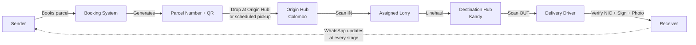
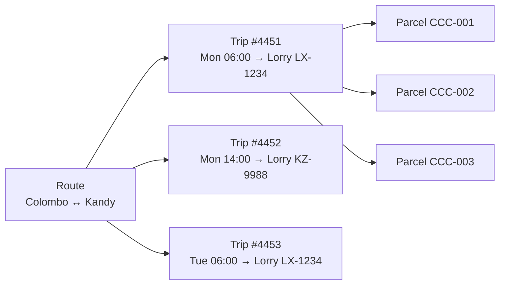
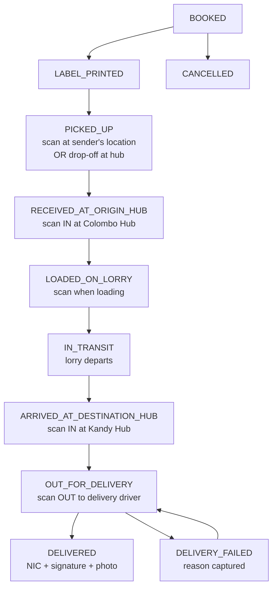
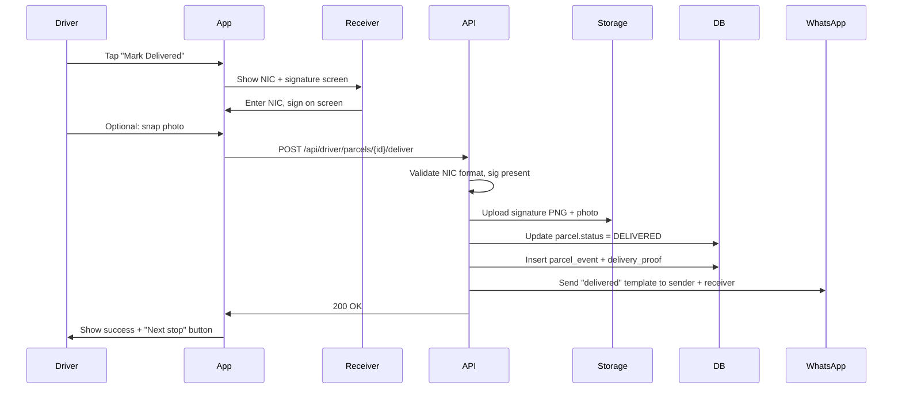
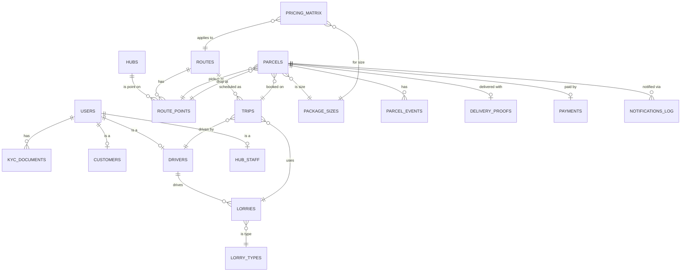
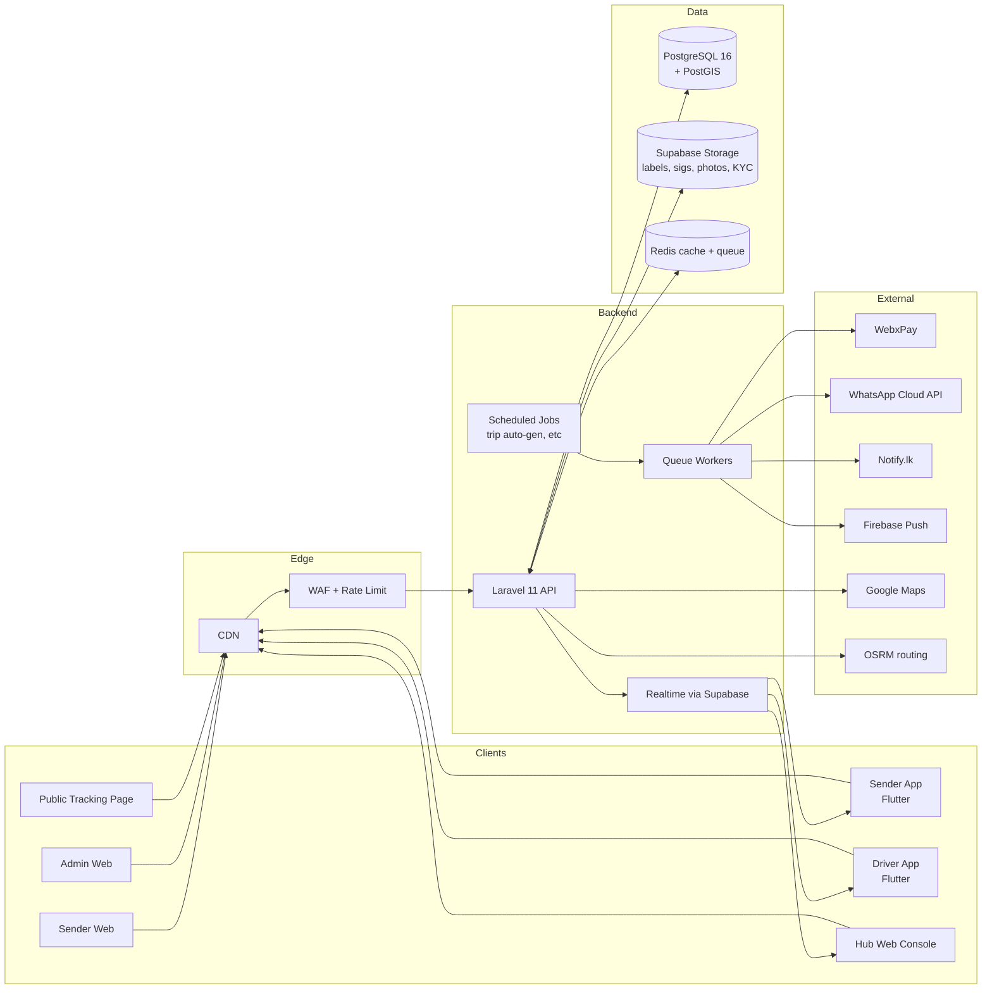

# 🚛 Colombo Cargo Connect (CCC) — Full Development Plan

> Scheduled hub-to-hub freight platform for Sri Lanka. Fixed routes (Colombo Hub ↔ Kandy Hub, etc.), per-package pricing, multi-pickup / multi-drop trips, QR/barcode scanning at every stage, WhatsApp status updates via Cloud API, and on-delivery verification with NIC + digital signature + photo.

---

## 📑 Table of Contents

1. [Concept & How CCC Differs](#1-concept--how-ccc-differs)
2. [Business Model & Revenue](#2-business-model--revenue)
3. [Package Sizes (S / M / L / XL / Bale)](#3-package-sizes)
4. [Per-Package Pricing Matrix](#4-per-package-pricing-matrix)
5. [Routes, Trips & Lorries](#5-routes-trips--lorries)
6. [Lorry Assignment — Auto vs Manual](#6-lorry-assignment--auto-vs-manual)
7. [Parcel Lifecycle with QR / Barcode](#7-parcel-lifecycle-with-qr--barcode)
8. [WhatsApp Notifications (Cloud API)](#8-whatsapp-notifications-cloud-api)
9. [Delivery Verification (NIC + Signature + Photo)](#9-delivery-verification)
10. [Public Tracking Page](#10-public-tracking-page)
11. [User Roles](#11-user-roles)
12. [Database Schema](#12-database-schema)
13. [System Architecture](#13-system-architecture)
14. [Tech Stack](#14-tech-stack)
15. [Folder Structure](#15-folder-structure)
16. [Claude Code Setup & Conventions](#16-claude-code-setup--conventions)
17. [Sprint-by-Sprint Execute Prompts](#17-sprint-by-sprint-execute-prompts)
18. [Sri Lanka Specifics](#18-sri-lanka-specifics)
19. [Next Steps Checklist](#19-next-steps-checklist)

---

## 1. Concept & How CCC Differs

**Colombo Cargo Connect** runs scheduled lorries on **fixed inter-city routes** between hubs. A customer books a parcel onto a specific route. The lorry runs the route on a scheduled date/time, picking up parcels from multiple sender points and delivering to multiple receiver points along the way.

### Different from on-demand logistics

| Dimension | On-demand (Uber-for-trucks) | **CCC (this plan)** |
|---|---|---|
| Pricing | Per-km, dynamic | **Flat per-package by size + route** |
| Routes | Anywhere → anywhere | **Fixed corridors only** (Colombo↔Kandy, etc.) |
| Vehicle | One trip = one customer | **One trip = many customers** (consolidation) |
| Match | Real-time bidding | **Pre-scheduled trips** the customer books into |
| Use case | Furniture, urgent freight | Daily inter-city parcels, retail distribution, agri |

### Core flow



---

## 2. Business Model & Revenue

### Revenue streams

| Stream | Description |
|---|---|
| **Per-parcel fee** | Primary — flat rate per size per route |
| **Doorstep pickup surcharge** | Extra if driver collects from sender's address vs sender dropping at hub |
| **Doorstep delivery surcharge** | Extra if driver delivers to receiver's address vs receiver collecting from hub |
| **Express trip** | Premium for next-trip-out vs scheduled-day departure |
| **Insurance add-on** | % of declared value, optional per parcel |
| **COD service fee** | 1.5–3% on cash collected from receiver |
| **Subscription (Shop)** | Monthly plan: discounted rates, volume credits, dedicated coordinator |
| **B2B contracts** | Negotiated bulk rates for daily-volume shippers |
| **Branded tracking page** | White-label tracking URL for big shippers (SaaS-style) |

### Cost structure (per trip)

- Driver wages (per-trip or per-month)
- Fuel
- Lorry lease / maintenance / insurance
- Hub rent + staff
- Tolls
- Platform/tech costs (SMS, WhatsApp, hosting)

Margin per trip = (Σ parcel revenues) − trip costs. Aim for ≥30% margin per trip after platform fees.

### Operational model

1. **Daily scheduled trips** on each direction of each route (e.g., Colombo→Kandy at 6 AM and 2 PM, Kandy→Colombo at 6 AM and 2 PM).
2. **Cut-off times** — bookings close X hours before trip departs.
3. **Capacity sold** per trip — booking blocked when trip is full.
4. **Same-day delivery** for short routes (Colombo↔Kandy, Colombo↔Galle); next-day for longer (Colombo↔Jaffna).

---

## 3. Package Sizes

Same five-tier system. Used for pricing, capacity, vehicle suitability, hub bin allocation.

| Code | Name | Max Weight | Max Dimensions (cm) | Capacity Units | Examples |
|---|---|---|---|---|---|
| **S** | Small | 5 kg | 30 × 25 × 15 | 1 | Documents, phones, samples |
| **M** | Medium | 25 kg | 60 × 45 × 40 | 4 | Boxes, electronics |
| **L** | Large | 75 kg | 120 × 80 × 80 | 10 | Appliances, multi-cartons |
| **XL** | Extra Large | 200 kg | 200 × 120 × 120 | 30 | Furniture, machinery |
| **Bale** | Bale / Pallet | 200 kg+ | ~120 × 100 × 150 | 50 | Textile, agri, paddy |

**Capacity Units** is how a trip's capacity is metered. A lorry has a fixed capacity-units cap (e.g., 300 units). When booked parcels' total ≥ cap, the trip is sold out.

Volumetric weight rule applies: chargeable weight = max(actual_kg, L×W×H ÷ 5000).

---

## 4. Per-Package Pricing Matrix

Pricing is a **lookup table**: route × size → base price. No distance math. Operations team can update via admin without code changes.

### Example matrix (LKR, indicative — tune from real costs)

| Route | S | M | L | XL | Bale |
|---|---|---|---|---|---|
| Colombo ↔ Kandy | 350 | 700 | 1,500 | 3,000 | 5,000 |
| Colombo ↔ Galle | 300 | 600 | 1,200 | 2,500 | 4,500 |
| Colombo ↔ Kurunegala | 300 | 600 | 1,200 | 2,500 | 4,500 |
| Colombo ↔ Anuradhapura | 600 | 1,100 | 2,200 | 4,500 | 7,500 |
| Colombo ↔ Jaffna | 900 | 1,700 | 3,200 | 6,500 | 11,000 |
| Colombo ↔ Batticaloa | 700 | 1,400 | 2,800 | 5,500 | 9,000 |
| Kandy ↔ Galle | 500 | 950 | 1,900 | 3,800 | 6,500 |

### Price = base + surcharges − discounts

```
final_price = route_size_base
            + (doorstep_pickup ? pickup_surcharge[size] : 0)
            + (doorstep_drop   ? drop_surcharge[size]   : 0)
            + (express         ? express_surcharge      : 0)
            + (insurance       ? declared_value × insurance_rate : 0)
            + (cod             ? cod_fee_min OR cod_amount × cod_rate : 0)
            − promo_discount
            − loyalty_discount
```

### Example surcharges

| Size | Pickup from address | Drop to address | Express |
|---|---|---|---|
| S | 200 | 200 | 300 |
| M | 350 | 350 | 500 |
| L | 600 | 600 | 800 |
| XL | 1,000 | 1,000 | 1,500 |
| Bale | 1,500 | 1,500 | 2,000 |

Insurance rate: 1.5% of declared value, minimum LKR 100. Cap declared value per parcel at LKR 500,000 (require manual approval above that).

---

## 5. Routes, Trips & Lorries

Three connected concepts:

### Route (the corridor)

A static corridor between two hubs. `colombo-kandy` runs in both directions. Each route has a list of allowed pickup/drop points (the hub itself + branches/agents along the way).

### Trip (a scheduled run)

A specific instance of a route on a date/time, with an assigned lorry and driver. E.g., `Trip #4451 — Colombo→Kandy — Mon Nov 3 at 06:00 — Lorry LX-1234 — Driver Sunil`.

Trips are pre-created (auto-generated for the next 14 days based on route schedule, then confirmed by ops). Customers book parcels onto a trip.

### Lorry (the vehicle)

A registered truck with a category (Mini / Light / Medium / Heavy / Refrigerated), capacity in kg and capacity-units, owner, insurance, etc.



### Pickup & drop points (along the route)

Each route has a list of approved pickup and drop points:

- The two main hubs (origin and destination)
- Branch offices / partner agents in towns along the way
- Doorstep pickup or doorstep delivery (geocoded address, surcharge applies)

For Colombo↔Kandy, intermediate points might include: Kadawatha, Nittambuwa, Warakapola, Kegalle, Mawanella, Peradeniya. Customer selects from a dropdown when booking.

---

## 6. Lorry Assignment — Auto vs Manual

When a customer is booking a parcel, two modes:

### Auto-assign (default, recommended)

System picks the **next available trip** on the chosen route+direction with sufficient capacity. Customer just sees: "Departing Mon 6 AM, arriving Mon 2 PM." Click confirm. Done.

### Manual select

Customer toggles "Choose specific lorry/trip" → sees a list of upcoming trips on that route with:
- Departure date/time
- Lorry plate + photo + capacity remaining
- Driver name + rating + photo
- ETA at destination
- Price (same — no premium for picking)

Use cases for manual:
- Repeat shippers who trust a specific driver
- Time-sensitive (need a specific departure)
- Compatibility (e.g., shipping textiles wants a covered lorry, not an open one)

### Trip visibility rules

- Customer sees only trips with status = `scheduled` or `loading` and capacity remaining ≥ their parcel's units
- Booked customers see the trip in their "My Parcels" with a tracking link

---

## 7. Parcel Lifecycle with QR / Barcode

Every parcel gets a **unique parcel number** + QR + Code128 barcode at booking.

### Parcel number format

```
CCC-YYYYMMDD-NNNNNN-X
│   │        │      └─ check digit (Luhn or mod-37)
│   │        └─── 6-digit sequence per day
│   └────────── booking date
└──────────── brand prefix
```

Example: `CCC-20251101-004572-7`

### Printable label

A 4×6 in label with:
- Parcel number (large)
- QR code (encodes signed token, not raw ID)
- Barcode (Code128 of parcel number)
- Sender name + phone
- Receiver name + phone
- Origin hub → Destination hub
- Size code
- Trip ID (optional)
- Tracking URL: `https://track.cargo.lk/CCC-XXXXX`

Customer can print at home or at hub. Ops can also pre-print rolls.

### Status pipeline (10 stages)



### Scan events

Every scan creates a `parcel_event` row with:
- `parcel_id`, `event_type`, `scanned_by_user_id`, `scanned_at` (UTC)
- `lat`, `lng` (from device)
- `hub_id` (if at hub)
- `trip_id` (if on lorry)
- `device_id`, `app_version`
- `notes` (optional: damage report, etc.)
- `photo_url` (optional)

### Scan validation rules

- Only allowed transitions are accepted (e.g., can't scan `DELIVERED` before `OUT_FOR_DELIVERY`)
- Wrong hub scan → blocked with error ("This parcel is for Kandy, not Galle")
- Already-delivered scans → ignored, returns success but no event
- Duplicate scans within 30 seconds → deduplicated

### Scanner types

| Who | Device | What they scan |
|---|---|---|
| Driver | Driver mobile app | Pickup, loading, delivery, failed-delivery |
| Hub Staff | Hub web console (camera + handheld scanner) | Hub IN, hub OUT |
| Receiver self-service | Customer mobile app | Confirm receipt (with NIC + sig) |

---

## 8. WhatsApp Notifications (Cloud API)

### ⚠️ Important: `wa.me` is NOT a sending API

`wa.me/<phone>` only opens a chat — it can't push automated status updates. For **automated outbound messages**, you have three real options:

| Option | Best for | Cost in LK |
|---|---|---|
| **WhatsApp Cloud API** (Meta direct) | This project — most flexible | First 1,000 service conversations/mo free, then ~$0.005–0.05/msg by category |
| **Twilio WhatsApp Business** | If you already use Twilio | Markup over Meta rates + Twilio fee |
| **Wati / AiSensy / 360Dialog** | Easiest setup, no-code dashboards | $30–80/mo + per-message |

**Recommendation: WhatsApp Cloud API direct** — cheaper at scale, no middleware, simple REST.

### What you need to set up

1. **Meta Business Manager** account
2. **Verified business** (business registration certificate upload)
3. **Phone number** dedicated to WhatsApp Business (not used for personal WhatsApp)
4. **Display name** approved
5. **Templates** approved by Meta (each template reviewed within 24h)

### Where `wa.me` IS useful

For **inbound** flows — when you want a customer to start a chat with you. Generate `https://wa.me/94XXXXXXXXX?text=I%20want%20to%20track%20CCC-20251101-004572-7` and paste into emails, SMS, the website. Customer taps, opens WhatsApp pre-filled.

You can also include `wa.me` links **inside** your Cloud API messages so receivers can quickly reply or contact support.

### Required message templates (submit to Meta for approval)

Pre-define these with placeholders. Cloud API references them by name + sends variables.

#### 1. `booking_confirmed` — to sender

```
Hi {{1}}, your parcel {{2}} from {{3}} to {{4}} has been booked with Colombo Cargo Connect.

Trip: {{5}}
Estimated delivery: {{6}}
Track here: {{7}}

Thank you for choosing CCC!
```

#### 2. `parcel_picked_up` — to sender + receiver

```
📦 Parcel {{1}} has been picked up.

From: {{2}}
To: {{3}}
Status: Picked up at {{4}}

Track live: {{5}}
```

#### 3. `arrived_at_origin_hub` — to sender + receiver

```
✅ Parcel {{1}} arrived at our {{2}} hub.

It will be loaded on the next outbound lorry.

Track: {{3}}
```

#### 4. `in_transit` — to receiver

```
🚛 Parcel {{1}} is on its way!

Lorry departed {{2}} at {{3}}.
Expected arrival at {{4}}: {{5}}.

Track live: {{6}}
```

#### 5. `arrived_at_destination_hub` — to receiver

```
🏢 Parcel {{1}} has arrived at our {{2}} hub.

You can collect it from {{3}} or wait for delivery.

Track: {{4}}
```

#### 6. `out_for_delivery` — to receiver

```
🛵 Parcel {{1}} is out for delivery.

Driver: {{2}} ({{3}})
ETA: {{4}}

Please keep your NIC ready for verification.

Track: {{5}}
```

#### 7. `delivered` — to sender + receiver

```
✅ Parcel {{1}} has been delivered.

Received by: {{2}} (NIC: {{3}})
Delivered at: {{4}}

Thank you for using Colombo Cargo Connect!
```

#### 8. `delivery_failed` — to sender

```
⚠️ Delivery attempt failed for parcel {{1}}.

Reason: {{2}}
Next attempt: {{3}}

Reply to this message to update delivery instructions.
```

#### 9. `cancelled` — to sender

```
Parcel {{1}} has been cancelled.

Refund of LKR {{2}} will be processed within {{3}} business days.

Reference: {{4}}
```

### Implementation

Send via Cloud API:

```
POST https://graph.facebook.com/v21.0/{phone_number_id}/messages
Authorization: Bearer {permanent_access_token}

{
  "messaging_product": "whatsapp",
  "to": "94771234567",
  "type": "template",
  "template": {
    "name": "out_for_delivery",
    "language": { "code": "en" },
    "components": [{
      "type": "body",
      "parameters": [
        { "type": "text", "text": "CCC-20251101-004572-7" },
        { "type": "text", "text": "Sunil P." },
        { "type": "text", "text": "+94 77 123 4567" },
        { "type": "text", "text": "30 minutes" },
        { "type": "text", "text": "https://track.cargo.lk/CCC-20251101-004572-7" }
      ]
    }]
  }
}
```

Wrap in a `WhatsAppService` in Laravel. Queue the actual sends so a slow Meta response doesn't block your status update.

---

## 9. Delivery Verification

On `OUT_FOR_DELIVERY → DELIVERED`, the driver's app collects:

### Required

1. **Receiver's NIC number** — typed by receiver into the driver's phone (or scanned via NIC-OCR if you add that later)
2. **Digital signature** — receiver signs with finger on driver's phone screen, captured as PNG (transparent background, ~300×100 px)

### Optional

3. **Package photo** — driver snaps the parcel at delivery point (proof it was intact)

### Validation rules

- NIC format: 9 digits + V/X (old) OR 12 digits (new). Accept both.
- Signature image must be > 5 KB (not a blank canvas).
- Photo, if provided, must be < 5 MB and one of: JPG, PNG, HEIC.

### Flow



### Schema

```sql
delivery_proofs
  id, parcel_id, delivered_by_user_id, receiver_nic, receiver_name,
  signature_url, photo_url, lat, lng, device_id, delivered_at
```

### Privacy & retention

- Encrypt NIC at rest (Laravel `Crypt::encryptString`).
- Mask NIC in logs (`xxxxxxxxxV → ******123V`).
- Retain delivery proofs for 1 year, then archive to cold storage.
- Comply with **Sri Lanka Data Protection Act 2022**.

---

## 10. Public Tracking Page

Every parcel gets a public tracking URL — `https://track.cargo.lk/{parcel_number}`.

No login required. Anyone with the link sees:
- Current status (with progress bar)
- Origin → Destination
- Trip date
- ETA
- Map showing latest scan location
- Status timeline (every event with timestamp)
- Receiver name (masked: "Kasun P.")
- Driver name (masked: "Sunil")
- "Contact Support" → opens `wa.me/<support>?text=Tracking%20{parcel_number}`

Built as a static-rendered Next.js page that fetches from a public read-only API. Heavy caching (30 sec TTL).

---

## 11. User Roles

| Role | Surface | Permissions |
|---|---|---|
| **Sender / Customer** | Mobile app + Web | Book parcel, pay, track, rate, raise dispute |
| **Receiver** | (No login) Tracking page + WhatsApp | View status, request reschedule via WhatsApp |
| **Driver** | Mobile app | Pick up, scan, deliver, capture proof |
| **Hub Staff** | Hub Web Console | Scan IN/OUT, manage hub inventory |
| **Hub Manager** | Hub Web Console | All staff + capacity overrides + manifest review |
| **Ops Admin** | Admin Web | KYC, trips, manual assignments, disputes |
| **Finance Admin** | Admin Web | Pricing matrix, payouts, refunds, invoices |
| **Support Admin** | Admin Web | Tickets, customer comms, parcel lookups |
| **Super Admin** | Admin Web | All of the above + role management + system settings |

---

## 12. Database Schema

UUID PKs, snake_case, soft deletes, UTC timestamps.



### Tables (key ones)

```sql
-- People
users(id uuid pk, phone, email, password_hash, role, status, language, created_at, ...)
customers(user_id pk fk, name, business_name, business_reg_no, default_pickup_address)
drivers(user_id pk fk, nic, license_no, license_expiry, rating_avg, total_trips)
hub_staff(user_id pk fk, hub_id fk, role) -- 'staff' or 'manager'

kyc_documents(id, user_id fk, doc_type, file_url, status, reviewed_by, reviewed_at, notes)

-- Geography & fleet
hubs(id, code, name, address, lat, lng, capacity_units, contact_phone, status)
lorry_types(id, name, capacity_kg, capacity_units, is_refrigerated)
lorries(id, plate_no, type_id fk, owner_id fk, year, photo_url, insurance_expiry, status)

-- Routes & trips
routes(id, code, origin_hub_id fk, destination_hub_id fk, distance_km_estimate,
       duration_hours_estimate, status)
route_points(id, route_id fk, hub_id fk nullable, name, address, lat, lng, sequence,
             allow_pickup, allow_drop, is_doorstep_zone)
trips(id, route_id fk, lorry_id fk, driver_id fk, scheduled_departure_at,
      actual_departure_at, scheduled_arrival_at, actual_arrival_at,
      capacity_remaining, status) -- scheduled, loading, in_transit, arrived, completed, cancelled

-- Sizes & pricing
package_sizes(code pk, name, max_weight_kg, max_l_cm, max_w_cm, max_h_cm, capacity_units)
pricing_matrix(id, route_id fk, size_code fk, base_price, pickup_surcharge,
               drop_surcharge, express_surcharge, effective_from, effective_to)

-- Parcels (the heart)
parcels(
  id uuid pk,
  parcel_number text unique,        -- CCC-YYYYMMDD-NNNNNN-X
  customer_id fk,
  trip_id fk nullable,
  route_id fk,
  pickup_point_id fk,               -- references route_points
  drop_point_id fk,
  size_code fk,
  weight_kg, length_cm, width_cm, height_cm,
  declared_value,
  description,
  sender_name, sender_phone,        -- denormalized for speed
  receiver_name, receiver_phone, receiver_address,
  doorstep_pickup boolean,
  doorstep_drop boolean,
  is_express boolean,
  is_insured boolean,
  is_cod boolean,
  cod_amount,
  base_price, surcharges_total, insurance_amount, cod_fee, discount, total_price,
  status,                           -- BOOKED, PICKED_UP, ... DELIVERED, FAILED, CANCELLED
  qr_token,                         -- signed token, what the QR encodes
  label_printed_at,
  picked_up_at, delivered_at, cancelled_at,
  created_at, updated_at, deleted_at
)

parcel_events(
  id, parcel_id fk, event_type, scanned_by_user_id fk,
  hub_id fk nullable, trip_id fk nullable,
  lat, lng, device_id, app_version,
  notes, photo_url,
  scanned_at, created_at
)

delivery_proofs(
  id, parcel_id fk, delivered_by_user_id fk,
  receiver_nic_encrypted, receiver_name,
  signature_url, photo_url,
  lat, lng, device_id, delivered_at
)

-- Payments
payments(id, parcel_id fk, method, amount, currency, gateway, gateway_ref, status, paid_at)
cod_collections(id, parcel_id fk, driver_id fk, amount, collected_at, settled_at)

-- Notifications
notifications_log(
  id, parcel_id fk nullable, channel,         -- whatsapp, sms, email, push
  template_name, recipient_phone, recipient_user_id fk nullable,
  payload jsonb, provider_ref, status,        -- queued, sent, delivered, read, failed
  error, sent_at, delivered_at, read_at
)

-- Disputes & support
disputes(id, parcel_id fk, raised_by_user_id fk, type, description, status,
         resolved_by fk, resolution, created_at, resolved_at)
support_tickets(id, user_id fk, parcel_id fk nullable, subject, status,
                priority, assigned_to fk, created_at)
ticket_messages(id, ticket_id fk, sender_id fk, body, attachments jsonb, sent_at)

-- Loyalty & promo
promo_codes(code pk, type, value, valid_from, valid_until, usage_limit, used_count)
loyalty_points(user_id fk, points_balance, lifetime_earned, lifetime_redeemed)
loyalty_transactions(id, user_id fk, parcel_id fk nullable, type, points, note, created_at)
```

### Key indexes

```sql
CREATE INDEX idx_parcels_customer ON parcels(customer_id, status);
CREATE INDEX idx_parcels_trip ON parcels(trip_id);
CREATE INDEX idx_parcels_number ON parcels(parcel_number);
CREATE INDEX idx_parcels_status ON parcels(status, created_at);
CREATE INDEX idx_parcel_events_parcel ON parcel_events(parcel_id, scanned_at);
CREATE INDEX idx_trips_route_dep ON trips(route_id, scheduled_departure_at, status);
CREATE INDEX idx_pricing_route_size ON pricing_matrix(route_id, size_code, effective_from);
CREATE INDEX idx_notifications_parcel ON notifications_log(parcel_id, sent_at);
```

---

## 13. System Architecture



---

## 14. Tech Stack

| Layer | Choice |
|---|---|
| Backend | **Laravel 11** (PHP 8.3), Sanctum auth |
| DB | **PostgreSQL 16 + PostGIS** |
| Realtime / Storage | **Supabase** |
| Cache / Queue | **Redis** |
| Web (Sender, Admin, Hub, Tracking) | **Next.js 15** + Tailwind + shadcn/ui + TypeScript |
| Mobile (Sender) | **Flutter 3.x** |
| Mobile (Driver) | **Flutter 3.x** |
| QR / barcode | `mobile_scanner` (Flutter), `react-zxing` (web) |
| Signature pad | `signature` Flutter package, `react-signature-canvas` web |
| Label printing | PDF via dompdf (Laravel) — works on home/office printer |
| WhatsApp | **WhatsApp Cloud API** (Meta) |
| SMS / OTP | **Notify.lk** |
| Payments | **WebxPay** (cards) + bank transfer + COD |
| Push | **Firebase Cloud Messaging** |
| Maps | **Google Maps** (display + autocomplete), **OSRM** (ETA) |
| Hosting (API) | **DigitalOcean App Platform** |
| Hosting (Web) | **Vercel** |
| CI / CD | **GitHub Actions** |
| Monitoring | **Sentry** + **Better Stack** |

---

## 15. Folder Structure

```
ccc/
├── backend/                          # Laravel 11
│   ├── app/
│   │   ├── Http/Controllers/
│   │   │   ├── Auth/
│   │   │   ├── Customer/             # Booking, parcels, payments
│   │   │   ├── Driver/               # Scan, deliver, trips
│   │   │   ├── Hub/                  # Hub IN/OUT, manifests
│   │   │   ├── Admin/                # Trips, pricing, users, disputes
│   │   │   └── Public/               # Tracking page API
│   │   ├── Models/
│   │   ├── Services/
│   │   │   ├── PricingService.php
│   │   │   ├── ParcelNumberService.php
│   │   │   ├── QrTokenService.php
│   │   │   ├── TripAssignmentService.php
│   │   │   ├── ScanService.php
│   │   │   └── WhatsAppService.php
│   │   ├── Jobs/                     # Queueable jobs (notifications, etc.)
│   │   └── Events/                   # ParcelStatusChanged, etc.
│   ├── database/migrations/
│   ├── database/seeders/
│   └── tests/
│
├── web-sender/                       # Sender web portal (Next.js)
├── web-admin/                        # Ops/Finance/Support admin (Next.js)
├── web-hub/                          # Hub staff console (Next.js)
├── web-tracking/                     # Public tracking page (Next.js, ISR)
│
├── mobile-sender/                    # Flutter sender app
├── mobile-driver/                    # Flutter driver app
│
├── docs/
│   ├── plan.md
│   ├── api.md
│   ├── prompts/                      # Reusable Claude Code prompts
│   └── adr/
│
├── .github/workflows/
├── docker-compose.yml
├── CLAUDE.md
└── README.md
```

---

## 16. Claude Code Setup & Conventions

### Prerequisites (Windows)

```powershell
choco install nodejs-lts git vscode postgresql php composer -y
flutter --version || choco install flutter -y
flutter doctor
node --version    # ≥ 20
php --version     # ≥ 8.3
```

### Init project

```bash
mkdir D:/Projects/ccc && cd D:/Projects/ccc
git init
echo "node_modules/`nvendor/`n.env`n.env.*`n*.log`n.DS_Store`nbuild/`ndist/" > .gitignore
npm install -g @anthropic-ai/claude-code
code .
```

### `CLAUDE.md` for this project

```markdown
# Colombo Cargo Connect — Project Context

## What we're building
Scheduled hub-to-hub freight platform for Sri Lanka. Fixed routes,
per-package pricing, QR/barcode scanning, WhatsApp status updates,
NIC + signature + photo on delivery. See COLOMBO_CARGO_CONNECT_PLAN.md.

## Stack
- Backend: Laravel 11 (PHP 8.3), Sanctum
- DB: PostgreSQL 16 + PostGIS
- Realtime/Storage: Supabase
- Cache/Queue: Redis
- Web: Next.js 15 (App Router) + TypeScript + Tailwind + shadcn/ui
- Mobile: Flutter 3.x
- WhatsApp: Cloud API (Meta) — NOT wa.me

## Domain rules
- Pricing is per-package by route + size. NEVER per-km.
- Routes are static; trips are scheduled instances of routes.
- Capacity is in "capacity units" (S=1, M=4, L=10, XL=30, Bale=50).
- Parcel numbers: CCC-YYYYMMDD-NNNNNN-X (X = check digit).
- Status pipeline is strict: only allowed transitions. Validate in
  ScanService.php; never bypass.
- All NIC values are encrypted at rest, masked in logs.
- Tracking page is public; hide PII (mask names, no phones).

## Conventions
- UUID PKs everywhere. Soft deletes. UTC timestamps.
- snake_case in DB & PHP, camelCase in TS & API JSON.
- TypeScript strict mode. ESLint + Prettier. Laravel Pint.
- LKR currency. Distances km, weights kg.
- Don't add new dependencies without asking.
- Don't write tests until I ask.
- Don't refactor unrelated code.

## Folder layout
backend/, web-sender/, web-admin/, web-hub/, web-tracking/,
mobile-sender/, mobile-driver/, docs/
```

### First Claude Code run

```bash
claude
```

Then:

```
Read COLOMBO_CARGO_CONNECT_PLAN.md and CLAUDE.md.
Don't write any code yet. Summarize the model, sprint plan, and what
you'll need from me to begin Sprint 1. Confirm you understand:
- per-package pricing (no distance)
- fixed routes with scheduled trips
- multi-pickup, multi-drop on same trip
- QR/barcode at every status change
- WhatsApp Cloud API (not wa.me)
- delivery requires NIC + signature + optional photo
```

---

## 17. Sprint-by-Sprint Execute Prompts

Copy each prompt verbatim into Claude Code when you reach that sprint. Run one prompt per session, review the diff, commit, then move on.

---

### 🟢 Sprint 1 — Backend Foundation

```
Scaffold a fresh Laravel 11 project in /backend.

1. composer create-project laravel/laravel . "11.*"
2. Configure .env.example for PostgreSQL 16 with placeholders for DB,
   Supabase, Redis, WhatsApp Cloud API, WebxPay, Notify.lk.
3. Install: laravel/sanctum, ramsey/uuid, spatie/laravel-permission,
   barryvdh/laravel-dompdf, predis/predis, propaganistas/laravel-phone.
4. Set up UUID primary keys globally (HasUuids trait base model).
5. Create migration to enable PostGIS extension.
6. Create migration for the users table with: id (uuid), phone (E.164,
   unique), email (nullable, unique), password (nullable, for admin
   only), role enum (customer, driver, hub_staff, hub_manager,
   admin_ops, admin_finance, admin_support, admin_super), status enum
   (pending, active, suspended, banned), language enum (en, si, ta),
   verified_at, soft deletes, timestamps.
7. Add a /api/health GET endpoint that returns { ok: true, time }.
8. Don't seed yet. Don't add any model code beyond User.

Show me the migration files before running migrate. Stop after running
migrations and confirming /api/health works locally.
```

---

### 🟢 Sprint 2 — Routes, Hubs, Lorries, Drivers

```
Build the geography & fleet domain.

Migrations:
- hubs: id (uuid), code (unique short like 'CMB','KDY'), name, address,
  lat (decimal 10,7), lng (decimal 10,7), capacity_units (int),
  contact_phone, status (active, inactive), timestamps.
- lorry_types: id (uuid), name, capacity_kg, capacity_units (int),
  is_refrigerated (bool).
- lorries: id (uuid), plate_no (unique), type_id fk, owner_id fk
  (users), year, photo_url (nullable), insurance_expiry, status
  (active, maintenance, retired), timestamps.
- routes: id (uuid), code (unique like 'CMB-KDY'), origin_hub_id fk,
  destination_hub_id fk, distance_km_estimate, duration_hours_estimate,
  status, timestamps.
- route_points: id (uuid), route_id fk, hub_id fk nullable, name,
  address, lat, lng, sequence (int), allow_pickup (bool),
  allow_drop (bool), is_doorstep_zone (bool), timestamps.
- drivers: user_id (uuid pk fk), nic, license_no, license_expiry,
  rating_avg (decimal 3,2 default 5), total_trips (int default 0),
  primary_lorry_id (nullable fk), home_zone (text).

Models with relationships. Form Request validation classes for create
& update of each. Eloquent observers to auto-populate code fields if
missing.

Seeder: insert real Sri Lankan hubs (Colombo, Kandy, Galle, Kurunegala,
Anuradhapura, Jaffna, Batticaloa) with rough lat/lng. Insert routes
between Colombo and each (bidirectional pair: 'CMB-KDY' and 'KDY-CMB').
Insert lorry_types: Mini, Light, Medium, Heavy, Refrigerated.

Add admin endpoints (gated by admin_ops or admin_super):
- POST/GET/PATCH /api/admin/hubs
- POST/GET/PATCH /api/admin/routes
- POST/GET/PATCH /api/admin/route-points
- POST/GET/PATCH /api/admin/lorries
- POST/GET/PATCH /api/admin/drivers (creates user + driver row)

Use spatie/laravel-permission for the role gates. Show me the
migrations before running.
```

---

### 🟢 Sprint 3 — Package Sizes & Per-Package Pricing Matrix

```
Build the pricing domain — per-package, lookup-based, NO distance math.

Migrations:
- package_sizes: code (varchar pk: S,M,L,XL,BALE), name,
  max_weight_kg, max_l_cm, max_w_cm, max_h_cm, capacity_units (int).
- pricing_matrix: id (uuid), route_id fk, size_code fk, base_price,
  pickup_surcharge, drop_surcharge, express_surcharge,
  effective_from, effective_to (nullable), status, timestamps.
  Unique active row per (route_id, size_code) at any given moment —
  enforce via partial index where status='active'.

Seed package_sizes with the spec from the plan (S=1, M=4, L=10, XL=30,
BALE=50 capacity units). Seed pricing_matrix with the example LKR
values from the plan for all routes × all sizes.

Create app/Services/PricingService.php with:
  quote(routeId, sizeCode, opts: { doorstep_pickup, doorstep_drop,
    express, declared_value, cod_amount, promo_code }) :
      { base, surcharges_total, insurance, cod_fee, discount,
        total, breakdown[] }

Endpoints:
- GET /api/customer/pricing/quote — JSON body, returns quote.
- GET /api/admin/pricing-matrix — paginated list.
- POST /api/admin/pricing-matrix — create new row (auto-deactivates
  previous active row for same route+size; sets effective_from = now).
- GET /api/public/pricing/published — read-only published prices for
  the marketing site.

Add unit tests for PricingService covering: every size, every route in
seed, all surcharge combos, declared value rounding, COD min fee.
```

---

### 🟢 Sprint 4 — Trips & Capacity

```
Implement the Trip system.

Migration:
- trips: id (uuid), route_id fk, lorry_id fk, driver_id fk,
  scheduled_departure_at, actual_departure_at, scheduled_arrival_at,
  actual_arrival_at, capacity_total (int, copied from lorry at create),
  capacity_remaining (int), status enum (scheduled, loading, in_transit,
  arrived, completed, cancelled), notes, timestamps.

Model + relationships. Trip belongs_to route/lorry/driver, has_many
parcels.

Service: app/Services/TripGenerationService.php
  - generateUpcoming(daysAhead = 14) : creates trips for routes with a
    schedule. For now, hard-code two daily trips per route (06:00 &
    14:00) — the schedule table can come later. Skip dates already
    generated.
  - assignLorry(tripId, lorryId, driverId) : with validation.
  - cancelTrip(tripId, reason).

Schedule the generator to run daily at 02:00 via Laravel's Schedule:
  $schedule->call(...)->daily()->at('02:00');

Endpoints:
- GET /api/admin/trips (filterable by route, date range, status)
- POST /api/admin/trips (manual create)
- POST /api/admin/trips/{id}/assign
- POST /api/admin/trips/{id}/cancel
- GET /api/customer/trips/upcoming?route_id=...&size_code=... — only
  returns trips with status in (scheduled, loading) and
  capacity_remaining ≥ size's capacity_units. Includes lorry photo,
  driver name + rating.

Add model events to keep capacity_remaining in sync when parcels are
booked / cancelled (we'll wire parcels next sprint).
```

---

### 🟢 Sprint 5 — Parcel Booking + Number + QR

```
Build parcel booking with QR generation.

Migration:
- parcels: full table per the plan. parcel_number is a unique varchar.
  qr_token is a unique varchar (signed). status enum starts at BOOKED.

Migration:
- parcel_events: per the plan. event_type enum covers all 10 stages
  plus DAMAGE_REPORTED. Index (parcel_id, scanned_at).

Services:
- app/Services/ParcelNumberService.php — generates "CCC-YYYYMMDD-NNNNNN-X"
  with mod-37 check digit. Uses Redis atomic counter per day to avoid
  race conditions.
- app/Services/QrTokenService.php — generates a JWT-style signed token
  encoding {parcel_id, version}. Verifies on scan to prevent forgery.

Endpoints:
- POST /api/customer/parcels — body: route_id, pickup_point_id,
  drop_point_id, size_code, weight_kg, dimensions, declared_value,
  description, sender (name+phone), receiver (name+phone+address),
  doorstep_pickup, doorstep_drop, is_express, is_insured, is_cod,
  cod_amount, trip_assignment ('auto' | trip_id), promo_code.
  
  Flow:
  1. Validate inputs; receiver phone must be Sri Lankan E.164.
  2. Compute price via PricingService.
  3. If trip_assignment='auto': pick next eligible trip
     (TripAssignmentService.pickAuto(routeId, sizeCode)).
     Otherwise validate the requested trip has capacity.
  4. Decrement trip capacity_remaining atomically (DB transaction with
     SELECT FOR UPDATE).
  5. Generate parcel_number + qr_token.
  6. Insert parcel row with status=BOOKED.
  7. Insert parcel_events row event_type=BOOKED.
  8. Dispatch job: SendWhatsAppNotification(parcel, 'booking_confirmed').
  9. Dispatch job: GenerateLabelPdf(parcel).
  10. Return parcel + tracking_url + label_url (signed, expires 1 day).

- GET /api/customer/parcels (paginated, filterable by status)
- GET /api/customer/parcels/{id}
- GET /api/customer/parcels/{id}/label.pdf — streams the label PDF
- POST /api/customer/parcels/{id}/cancel — only if status=BOOKED;
  refunds + restores trip capacity + sends 'cancelled' WhatsApp.

Label PDF: 4×6 in, single-page, includes parcel_number (large), QR
(encoding qr_token), Code128 barcode (encoding parcel_number), sender,
receiver, route, size, trip date, tracking URL.

Tests: parcel creation (every combination), capacity decrement under
concurrency (use DB transactions test), check digit generation,
cancellation refund.
```

---

### 🟢 Sprint 6 — Scan & Status Pipeline

```
Build the scan engine — the heart of operations.

Service: app/Services/ScanService.php

  scan(scannerUserId, qrTokenOrParcelNumber, scanContext): ParcelEvent

  Where scanContext = {
    event_type,             // PICKED_UP, RECEIVED_AT_ORIGIN_HUB, etc.
    hub_id?,                // required for hub events
    trip_id?,               // required for transit events
    lat, lng, device_id, app_version,
    notes?, photo_url?
  }

Rules:
- Resolve parcel by QR token (preferred) or parcel_number.
- Verify scanner has permission for that event_type (e.g., only hub
  staff can do RECEIVED_AT_*_HUB; only assigned driver can do
  PICKED_UP/LOADED/IN_TRANSIT/OUT_FOR_DELIVERY).
- Validate state transition. Allowed map:
    BOOKED → PICKED_UP (or CANCELLED)
    PICKED_UP → RECEIVED_AT_ORIGIN_HUB
    RECEIVED_AT_ORIGIN_HUB → LOADED_ON_LORRY
    LOADED_ON_LORRY → IN_TRANSIT
    IN_TRANSIT → ARRIVED_AT_DESTINATION_HUB
    ARRIVED_AT_DESTINATION_HUB → OUT_FOR_DELIVERY
    OUT_FOR_DELIVERY → DELIVERED (or DELIVERY_FAILED)
    DELIVERY_FAILED → OUT_FOR_DELIVERY (retry)
- Invalid transition → throw 422 with {expected: [...], got: ...}.
- Hub mismatch → 422 ("This parcel routes via Kandy, not Galle").
- Wrong trip → 422.
- Duplicate scan within 30s → return existing event, no new insert.
- On success: insert parcel_events row, update parcels.status &
  picked_up_at / delivered_at as appropriate. Fire ParcelStatusChanged
  event. Dispatch SendWhatsAppNotification job with the matching
  template.

Endpoints:
- POST /api/driver/scan — body: { qr_token | parcel_number,
  event_type, lat, lng, device_id, ... }
- POST /api/hub/scan — same shape, but enforces hub_staff role +
  scanner's hub_id auto-attached.
- GET /api/parcels/{number}/timeline — public read endpoint
  returning the event list (for tracking page). Mask scanner names.

Listener: when ParcelStatusChanged fires, queue WhatsApp notification.

Tests: every valid transition, every invalid transition, hub
mismatch, duplicate-within-30s, permission denial.
```

---

### 🟢 Sprint 7 — WhatsApp Cloud API Integration

```
Wire up WhatsApp Cloud API.

Add to .env:
  WHATSAPP_PHONE_NUMBER_ID=
  WHATSAPP_BUSINESS_ACCOUNT_ID=
  WHATSAPP_ACCESS_TOKEN=
  WHATSAPP_WEBHOOK_VERIFY_TOKEN=

Service: app/Services/WhatsAppService.php
  sendTemplate(toPhone, templateName, languageCode = 'en', params: array)
  sendText(toPhone, body) // for non-template (within 24h window)
  parseWebhook(payload) // returns DeliveryStatus events

Job: SendWhatsAppNotification(parcelId, templateName, recipientType:
  'sender'|'receiver'|'both')
  - Loads parcel + recipient
  - Builds params from template config (in config/whatsapp_templates.php)
  - Calls WhatsAppService.sendTemplate
  - Logs to notifications_log (status: queued → sent → delivered → read)
  - On failure: retry with exponential backoff (3 attempts)
  - On final failure: mark failed, notify support

Templates config (config/whatsapp_templates.php):
  Map every status transition to a template name + recipient mode +
  parameter builder closure. Use the 9 templates from the plan.

Webhook endpoint:
- POST /api/webhooks/whatsapp — verify signature, parse delivery
  receipts, update notifications_log.status.
- GET /api/webhooks/whatsapp — Meta's hub.challenge verification.

Helper for tracking URLs: TrackingUrlBuilder::for(parcel) returns
https://track.cargo.lk/{parcel_number}.

Helper for wa.me CTA links: WaMeBuilder::contact(supportPhone, prefill)
returns https://wa.me/{phone}?text={urlencoded_prefill}. Used inside
templates and in the customer app's "Contact us" buttons.

Tests: mock the Meta API, assert correct payload shape per template,
assert retry behavior, webhook signature verification.

NOTE: Templates must be submitted to Meta and approved before sending.
Add docs/whatsapp_templates_meta.md with the exact text + variable
order for each template, ready to paste into Meta's template manager.
```

---

### 🟢 Sprint 8 — Driver Mobile App

```
Scaffold /mobile-driver in Flutter 3.x.

Architecture: clean architecture per feature (data/domain/presentation).
State: Riverpod. Routing: go_router. HTTP: Dio with token interceptor.

Packages:
- mobile_scanner (QR + barcode)
- geolocator + permission_handler
- signature
- image_picker
- flutter_secure_storage
- firebase_messaging
- supabase_flutter (for realtime presence)

Screens (in order):
1. Login — phone + OTP (calls /api/auth/phone/start and /verify).
2. Home — shows assigned trips today + tomorrow. Tap a trip to open
   trip detail.
3. Trip Detail — list of parcels on this trip grouped by pickup_point
   and drop_point. "Start Trip" button toggles status to in_transit.
4. Scan — full-screen camera, captures QR or barcode. After successful
   read, shows parcel summary and event_type buttons (Pickup, Hub IN,
   Loaded, Out for Delivery, Delivered, Failed).
5. Delivery — opens when scanning DELIVERED. Shows: receiver name
   pre-filled, NIC input (validated NIC pattern), signature pad
   (full-width, height 200), optional camera button for parcel photo.
   Submit button posts to /api/driver/parcels/{id}/deliver with
   multipart (signature.png, photo.jpg).
6. Failed Delivery — reason picker (Receiver not available, Wrong
   address, Refused, Damaged, Other) + notes + optional photo.
7. Earnings — list of completed trips with payout status.
8. Profile — KYC status, vehicle, settings.

Flow polish:
- Background location while trip is in_transit, throttled to every 30s.
- Offline queue: scans collected offline are queued in SQLite and
  flushed when online (idempotent server side via device_id +
  client_event_id).
- Vibration + sound on successful scan.

Tests: widget tests for the signature & NIC validators.
```

---

### 🟢 Sprint 9 — Sender Mobile App

```
Scaffold /mobile-sender in Flutter — for shop owners and individuals
booking parcels.

Screens:
1. Login (phone OTP).
2. Home — quick "New Parcel" button + recent parcels list with status
   chips.
3. New Parcel — multi-step wizard:
   Step 1: Route — origin hub + destination hub picker (typeahead).
   Step 2: Pickup point — dropdown of route_points with
     allow_pickup=true, plus "Pickup from my address" option (if route
     has is_doorstep_zone).
   Step 3: Drop point — same logic with allow_drop.
   Step 4: Package — size picker (S/M/L/XL/Bale chips with
     weight/dimension hints), weight + dimensions, description, photo.
   Step 5: Sender + Receiver — names + phones (+ receiver address if
     doorstep_drop).
   Step 6: Options — express, insurance (with declared value), COD
     (with amount).
   Step 7: Trip — auto OR pick a specific trip (list with lorry photo,
     driver, departure time, capacity remaining).
   Step 8: Review + Pay — quote breakdown, payment method (WebxPay or
     bank transfer or COD).
4. Parcel Detail — status timeline, tracking URL share, label download,
   "Open WhatsApp chat with support" (uses wa.me).
5. Loyalty — points balance + history.
6. Profile — KYC, addresses, payment methods.

UX details:
- Show estimated arrival ("Arrives Mon evening").
- Inline price recalculation as options change (debounced).
- Tracking detail screen has a "Send tracking link via WhatsApp" button
  that opens wa.me with a prefilled message.
```

---

### 🟢 Sprint 10 — Hub Web Console

```
Build /web-hub (Next.js 15) for hub staff.

Auth: only users with role=hub_staff or hub_manager. Their hub_id is
auto-applied to all queries.

Pages:
- /login
- /scan — primary screen. Big "Open Camera" button (web QR via
  zxing-js). Manual entry fallback (paste parcel number).
  After scan: show parcel summary + Action buttons:
    - "Receive at this hub" → POST /api/hub/scan event=RECEIVED_AT_*_HUB
    - "Load on lorry" → asks for trip_id (today's outbound trips on
      this hub) → POST event=LOADED_ON_LORRY
    - "Out for delivery" → asks for driver → POST
      event=OUT_FOR_DELIVERY
- /inbound — list of parcels arriving at this hub today (from in_transit
  trips with this hub as destination_hub).
- /outbound — list of parcels at this hub awaiting load, grouped by
  next trip.
- /inventory — current parcels physically at this hub (status in
  RECEIVED_AT_ORIGIN_HUB, ARRIVED_AT_DESTINATION_HUB).
- /manifest — printable per-trip manifest (list of parcels with
  pickup_point → drop_point, sender/receiver, size).

Print stylesheet for /manifest. Use react-zxing or html5-qrcode for the
camera scanner. Support USB/Bluetooth handheld barcode scanners as a
keyboard input.

Polish: keyboard shortcut for scan focus, audible beep on success/fail,
session timeout after 30 min idle.
```

---

### 🟢 Sprint 11 — Sender Web Portal

```
Build /web-sender (Next.js 15) — same booking capability as the mobile
app, plus features that benefit from a bigger screen.

Pages:
- /login
- /dashboard — KPIs (parcels this month, spend, in-transit count) +
  recent parcels table.
- /book — same wizard as mobile (use shadcn/ui Stepper).
- /parcels — paginated table with filters (status, route, date range),
  bulk actions (export CSV, download all labels as ZIP).
- /parcels/[number] — detail with timeline + map.
- /addresses — saved sender + receiver addresses.
- /payments — invoice list, downloadable receipts.
- /loyalty — points + redeem.
- /settings — KYC, business info, API key (for shops that want to
  programmatically book — Phase 2).

Bulk booking via CSV upload — for shops sending 50+ parcels a day.
Validate row-by-row, show errors inline, then book all at once.

Embed the public tracking iframe on the detail page so the customer
sees exactly what their receiver sees.
```

---

### 🟢 Sprint 12 — Public Tracking Page

```
Build /web-tracking (Next.js 15, ISR) at https://track.cargo.lk.

Single page: /[parcelNumber]
- Server-side fetch from /api/public/parcels/{number} (no auth needed).
- 30-second ISR cache. Revalidate on demand via webhook from API after
  status changes.
- Layout: hero with status pill + progress bar, timeline of events,
  map showing latest scan location (Google Maps, lat/lng from the
  freshest event), masked sender/receiver names, ETA.
- "Contact support" button → wa.me/{support}?text=Tracking%20{number}
- Mobile-first responsive layout.
- OG meta tags so the link previews well in WhatsApp.

API:
- GET /api/public/parcels/{number} — returns sanitized parcel + events.
  Hide phone numbers, mask names ("Kasun P."), strip device_ids.
  Cache-Control: public, max-age=30.

Lighthouse goal: ≥95 on mobile.
```

---

### 🟢 Sprint 13 — Admin Dashboard

```
Build /web-admin (Next.js 15) for ops, finance, support, and super
admins. Use shadcn/ui dense layout (DataTable component).

Modules:

1. Dashboard — KPIs: bookings today, in_transit count, deliveries
   today, revenue today, failed deliveries, pending KYC. Charts:
   parcels by route, revenue by route, on-time % per driver.

2. Bookings — full parcel table, search by parcel number / phone /
   NIC, filter by status / route / date. Bulk reassign trip.

3. Trips — calendar + list view. Click a trip to see manifest, current
   location, all parcels. Manually assign/reassign lorry+driver.
   "Force complete" / "Cancel".

4. Routes & Pricing — edit routes, route_points, pricing matrix.
   Bulk edit pricing (e.g., +5% across all routes).

5. Fleet — lorries, drivers, KYC queue with approve/reject.

6. Hubs — capacity, current inventory, staff.

7. Finance — payment list, refunds, COD reconciliation, driver
   payouts (request → approve → mark paid with bank ref), invoices.

8. Disputes & Tickets — ticket inbox with assignment, replies.

9. Notifications log — every WhatsApp/SMS sent, status, retries.
   Resend button.

10. Settings — promo codes, language strings, feature flags, holidays
    (no trips on these dates), system announcements.

Permissions: enforce per-role at the page level + API level. Support
admin sees support + parcels read-only; finance sees finance + parcels
read-only; ops sees most things; super sees all.

Audit log: every admin action writes to audit_logs table.
```

---

### 🟢 Sprint 14 — Polish, Performance, Launch Prep

```
Pre-launch hardening:
1. Add rate limits per endpoint (Sanctum throttle middleware).
2. Add Sentry to backend, all webs, and Flutter apps.
3. Add Better Stack uptime monitors for /api/health, tracking page,
   Cloud API webhook.
4. Add logging redaction for: NIC, phone (last 4 digits ok),
   receiver_name on public endpoints, signatures, photos URLs.
5. Add daily backups: PG dump to Supabase storage encrypted bucket.
6. Add a maintenance-mode kill switch (config/maintenance.php) that
   queues all writes if true.
7. Load test: simulate 100 concurrent bookings, 500 concurrent scans
   on the same trip. Fix any race conditions.
8. Onboarding flow polish: empty states, error states, success states.
9. Tracking page Lighthouse pass.
10. Translate strings to Sinhala + Tamil for the sender app and
    tracking page (use next-intl + Flutter intl).
11. Print 100 trial labels, scan them all on real handheld scanners
    and on a budget Android phone — fix any read-failures.

Pilot launch checklist:
- 1 route only (Colombo↔Kandy)
- 2 trips per day per direction
- 2 lorries, 2 drivers, 4 hub staff (2 per hub)
- 5 friendly shops as senders
- 100 parcels in week 1
- Daily standup to triage issues
- Weekly retro + plan changes
```

---

## 18. Sri Lanka Specifics

### KYC docs

- Customers: BR cert (if business), NIC of authorized person
- Drivers: NIC, driving license (front + back), vehicle registration, insurance certificate
- Auto-validate NIC format: `^\d{9}[VvXx]$` OR `^\d{12}$`

### Payments

- **WebxPay** primary (cards)
- **Bank transfer** for B2B (BOC, Sampath, Commercial, HNB common)
- **Cash on delivery** with driver settlement at hub
- Optional later: PayHere, Genie, FriMi, eZ Cash

### SMS fallback

When WhatsApp delivery fails (recipient doesn't have WhatsApp), the SendWhatsAppNotification job catches the failure and queues an SMS via Notify.lk with a shortened version of the message + tracking URL. This is critical — many older shop owners and rural receivers don't use WhatsApp.

### Languages

- en (default)
- si (Sinhala)
- ta (Tamil)

User picks in profile. WhatsApp templates need to be submitted in each language separately to Meta.

### Holidays

Sri Lanka has many public + religious holidays. Add a `holidays` table in admin so trips don't auto-generate on those days. Mercantile holidays + Poya days at minimum.

### Compliance

- TRC for SMS sender ID
- Data Protection Act 2022 — register as a data controller, have a privacy policy
- If carrying restricted goods, Customs / Excise may apply
- Insurance partnership: Sri Lanka Insurance, Allianz, AIA

---

## 19. Next Steps Checklist

- [ ] Create `D:/Projects/ccc/` folder, init git, push to private GitHub repo
- [ ] Save this file as `COLOMBO_CARGO_CONNECT_PLAN.md` in the root
- [ ] Save the `CLAUDE.md` from Section 16
- [ ] Install Claude Code + VS Code extensions
- [ ] Sign up for: Supabase, WebxPay sandbox, Notify.lk, Google Cloud (Maps), Vercel, Firebase, **Meta Business Manager (for WhatsApp Cloud API)**, **GS1 Sri Lanka** (for barcode prefix if you want global-standard barcodes — optional, your own internal codes work fine)
- [ ] Begin WhatsApp business verification with Meta — this can take 2–3 weeks, start it now in parallel with development
- [ ] Submit the 9 WhatsApp templates from Section 8 for approval
- [ ] Run Sprint 1 prompt in Claude Code
- [ ] Verify backend boots, /api/health returns OK
- [ ] Commit, push, repeat through Sprint 14

---

## 📌 Final Notes

**Build it route by route.** Don't try to launch with 7 routes on day 1. Prove the model on Colombo↔Kandy first. Add Galle next. Scale only after operations are smooth.

**WhatsApp is the killer feature.** Sri Lankan customers live on WhatsApp. Get the templates approved early, get them right, and they'll be your single biggest UX win over competitors using SMS or email.

**The QR code is your operational backbone.** Every problem in logistics — wrong delivery, missing parcel, delays — traces back to "where is this thing right now?" If every parcel has a QR scanned at every checkpoint, you have an instant answer. Drill staff to scan religiously.

**Per-package pricing is your moat.** Customers hate surprise bills from per-km calculations. "S parcel from Colombo to Kandy = LKR 350. Always." That's a marketing message that wins.

When you want me to expand any sprint into more granular sub-prompts, generate the actual Laravel migrations, or design the wireframes for a specific screen — just ask which one.

🚛 Good luck with CCC.
